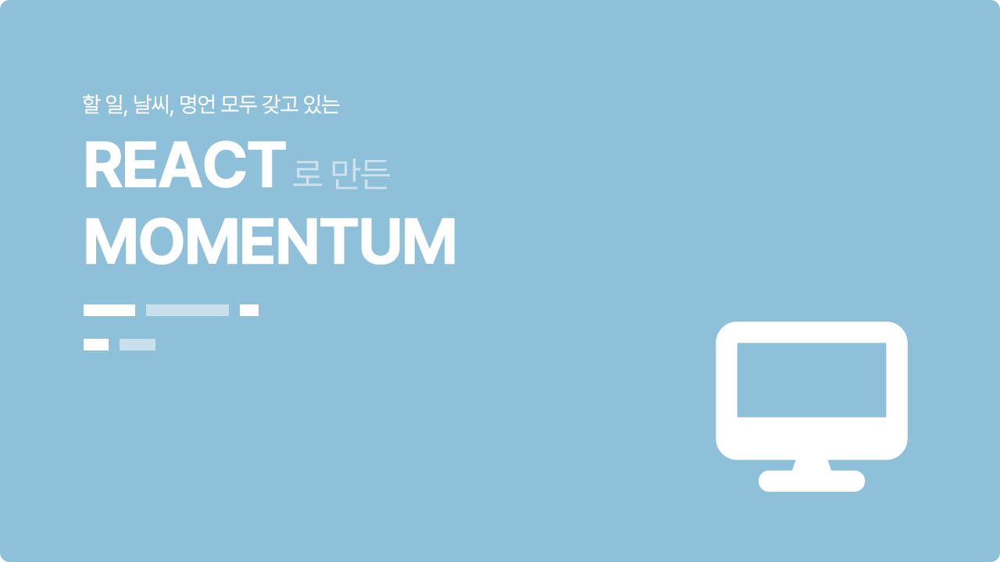
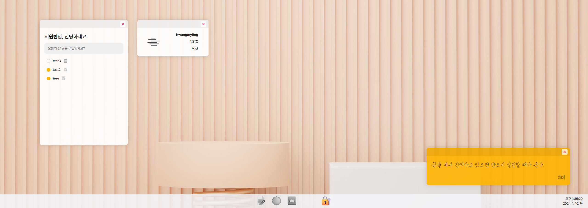
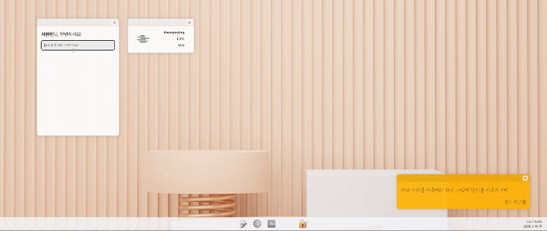
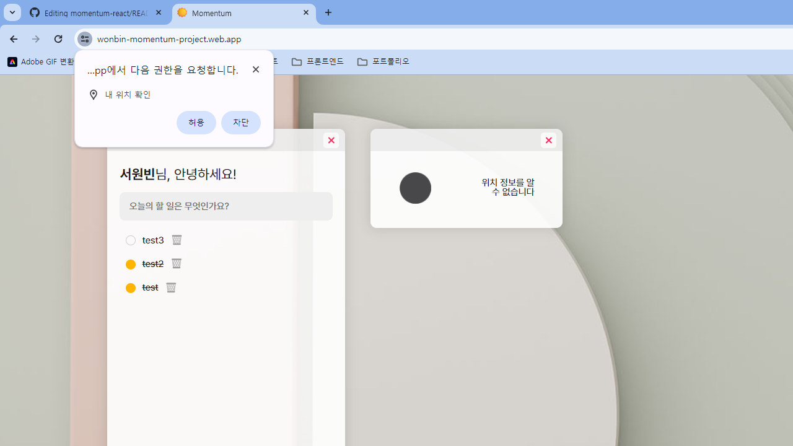
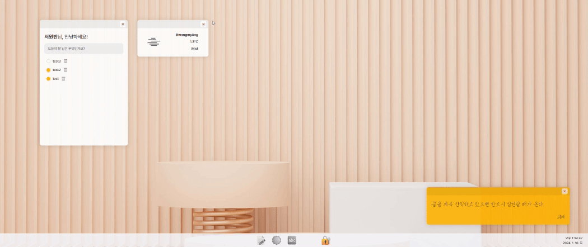
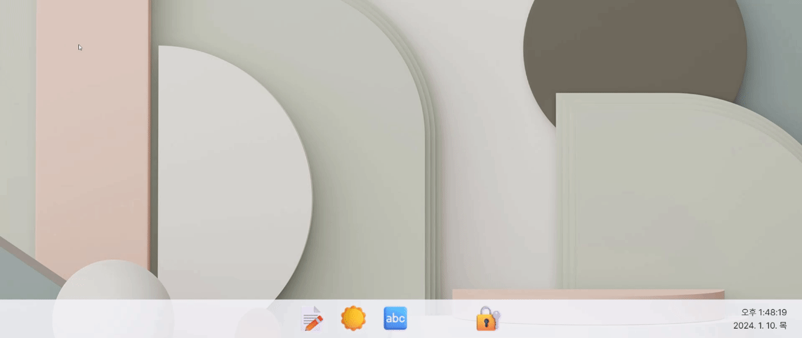
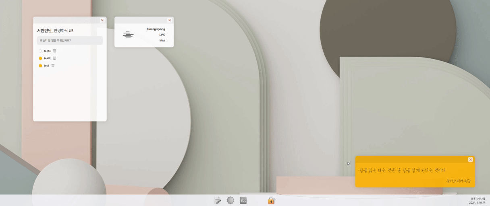

 

# 할일, 날씨, 명언 모두 가지고 있는, MOMENTUM
<a href="https://wonbin-momentum-project.web.app/" title="새 창으로 열기" target="_blank">https://wonbin-momentum-project.web.app/</a>
<blockquote>사용자의 이름을 저장하여 노출시키고, 할 일 목록과 날씨, 명언을 보여주는 리액트 앱입니다.</blockquote>
 

## 프로그래밍 언어 & 프레임워크

  
  
  
  

 

### 윈도우 11 화면과 비슷하게 구현해 보았어요

 

### 사용자의 이름을 입력하여 로그인 할 수 있어요

<blockquote>이름은 로컬저장소에 저장되고, data가 있을 경우 로그인 화면이 나타나지 않아요.</blockquote>
 

### 할 일 목록을 통해 할 일을 생성/삭제 및 수행 여부를 기록할 수 있어요

 

### 위치 허용을 통해 사용자가 현재 위치해있는 장소의 날씨를 알 수 있어요

<blockquote>weather API라는 open API를 사용하였습니다. https://openweathermap.org/api</blockquote>
 

### 새로고침 할 때마다 새로운 바탕화면과 새로운 명언을 만나 볼 수 있어요

 

### 닫기 버튼을 통해 창을 닫을 수 있고, 하단 바를 통해 다시 열 수 있어요

<blockquote>창의 실행 여부를 하단 바의 아이콘 색상을 통해 알 수 있어요</blockquote>
 

### 하단 바 우측의 시계를 통해 오늘 일자와 날씨를 알 수 있어요

 

### 로그아웃 기능을 통해 데이터를 초기화 시킬 수 있어요

<blockquote>해당 기능은 로컬저장소의 데이터를 전부 초기화 시키기 때문에  페이지를 새로고침하거나 다시 방문할 경우 로그인 화면부터 다시 시작하게 됩니다.</blockquote>
